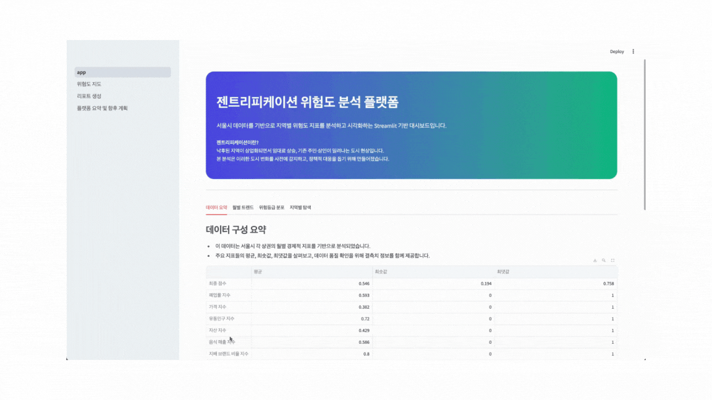
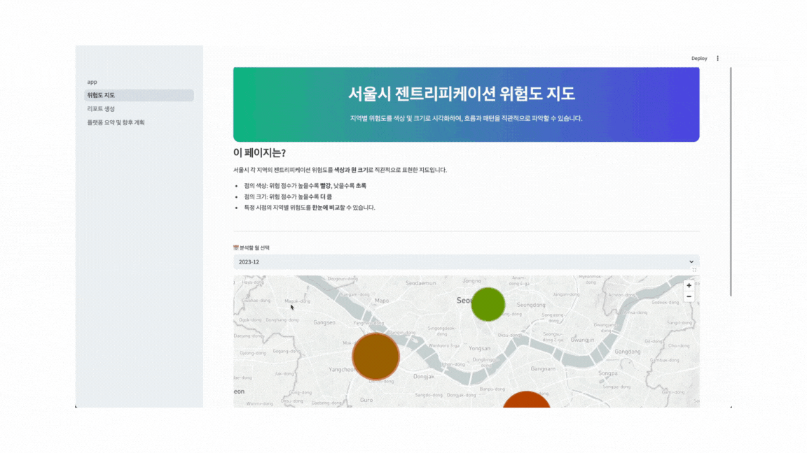
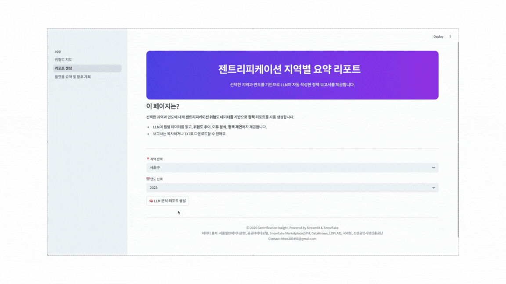
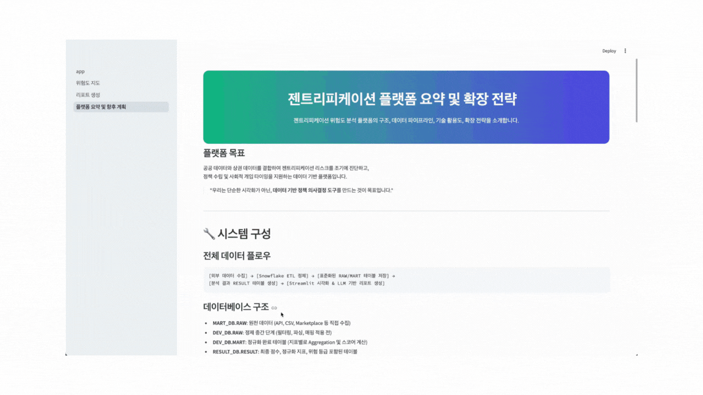

<div align="center">
  <h2>[2025] Gentrification Insight 🏙️</h2>
  서울시의 젠트리피케이션 리스크를 진단하고, AI가 자동으로 정책 리포트를 작성해주는 데이터 기반 플랫폼입니다. <br>
  도시 문제에 대한 선제적 대응을 목표로, 다양한 공공/민간 데이터를 통합하여 시각화하고, <br>
  정책 결정자가 실시간으로 위험 지역을 파악하고 대응 전략을 세울 수 있도록 돕습니다.
</div>

<p align="center">
  <a href="https://gentrification.streamlit.app/">
    
  </a>
</p>

---

## 목차
- [개요](#개요)
- [핵심 기능](#핵심-기능)
- [데이터 흐름 및 구조](#데이터-흐름-및-구조)
- [LLM 기반 리포트 예시](#llm-기반-리포트-예시)
- [향후 계획](#향후-계획)

---

## 개요
- 프로젝트명: **Gentrification Insight**
- 프로젝트 기간: 2025.04.11 – 2025.04.14
- 주요 기술: `Streamlit`, `Snowflake SQL`, `Cortex LLM`, `Altair`, `Pydeck`
- 데이터 출처: 서울열린데이터광장, 공공데이터포털, Snowflake Marketplace (SPH, DataKnows 등)

> “젠트리피케이션을 감지하고, 위험 지역에 대한 정책적 개입을 돕는 것이 우리의 목표입니다.”

---

## 핵심 기능

| 기능명 | 설명 |
|--------|------|
| 데이터 대시보드 | 주요 지표 요약, 결측치 분석, 월별/지역별 트렌드 시각화<br> |
| 위험도 지도 | 월별 FINAL_SCORE 기준 지역별 색상/크기 시각화<br> |
| LLM 리포트 생성 | Snowflake Cortex로 정책 리포트 자동 생성<br> |
| 플랫폼 구성 요약 | DB 구조 및 Snowflake 처리 흐름 설명 페이지<br> |

---

## 데이터 흐름 및 구조

```text
[데이터 수집]
 → [Snowflake 전처리 (RAW/MART)]
 → [정규화된 RESULT 테이블 생성]
 → [Streamlit 대시보드 및 리포트 생성]
```

### 📂 주요 DB 계층
- `MART_DB.RAW`: 원본 수집 데이터
- `DEV_DB.RAW`: 전처리 초기 단계 (필터링/매핑)
- `DEV_DB.MART`: 지표 산출/정규화 결과 저장
- `RESULT_DB.RESULT`: 최종 점수 및 등급 포함 테이블 (활용 테이블)

### 📌 주요 컬럼
| 컬럼명 | 설명 |
|--------|------|
| REGION_NAME | 행정구 이름 |
| MONTH | 연-월 날짜 |
| FINAL_SCORE | 정규화된 지표의 가중합 (위험도) |
| DANGER_LEVEL | 위험 등급 (낮음/보통/높음) |
| NORM_* | 개별 지표 (유동인구, 폐업률 등)의 정규화 값 |

---

## LLM 기반 리포트 예시

```
2023년 마포구는 8월 위험도 최고치인 0.82를 기록했습니다.
이는 유동인구 급증과 프랜차이즈 매장 비율 상승이 복합적으로 작용한 결과입니다.
이에 따라 소상공인의 임대료 부담이 커질 가능성이 있으며,
단기적인 임대료 완화 정책과 상권 다양성 유지 대책이 요구됩니다.
```

> ☑️ Snowflake Cortex의 `COMPLETE(model, prompt)` 함수를 사용하여 자동 생성

---

